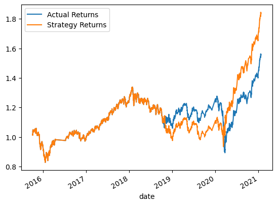

# Module_14_challenge
## Introduction
This project develops an algorithmic trading bot that learns and adapts to new data and evolving markets.  It will establish a baseline by ingesting an `OHLCV` file for an `MCSI`-based emerging markets ETF, generating signals using short and long-window SMA values and finally using the `SVC` model learning method to fit the training data nad make predictions based on the testing data.  

This will be followed by tuning the bot by adjusting the size of the training dataset and adjusting the SMA windows and evaluating the results against the baseline.  

Finally the bot will be evaluated using a new machine learning classifier model.

## Baseline
The `SVC` driven baseline yielded a precision accuracy score of 55%

||precicion|recall|f1-score|support|
|-|-|-|-|-|
|-1.0|0.43|0.04|0.07|1804|
|1.0|0.56|0.96|0.71|2288|
|accuracy|||0.55|4092|
|macro avg|0.49|0.50|0.39|4092|
weighted avg|0.50|0.55|0.43|4092|

As can be seen below, the `SVC` strategy mapped the actual returns fairly closely.

## First tuning attempt - using 6 months training data
The `SVC` driven baseline yielded a precision accuracy score of 56%

||precicion|recall|f1-score|support|
|-|-|-|-|-|
|-1.0|0.44|0.02|0.04|1732|
|1.0|0.56|0.98|0.71|2211|
|accuracy|||0.56|3943|
|macro avg|0.50|0.50|0.38|3943|
weighted avg|0.51|0.56|0.42|3943|

As can be seen below, the `SVC` strategy did not map the actual returns as well than the baseline.

## Second tuning attempt - restore training data to 3 months and change the short window to 2
The `SVC` driven baseline yielded a precision accuracy score of 56%

||precicion|recall|f1-score|support|
|-|-|-|-|-|
|-1.0|0.41|0.01|0.03|1804|
|1.0|0.56|0.99|0.71|2288|
|accuracy|||0.56|4092|
|macro avg|0.49|0.50|0.37|4092|
weighted avg|0.49|0.56|0.41|4092|

As can be seen below, the `SVC` strategy did not map the actual returns as well than the baseline.

## Conclusion on baseline vs tuned model
The tuning of the short SMA window provided a more accurate prediction.